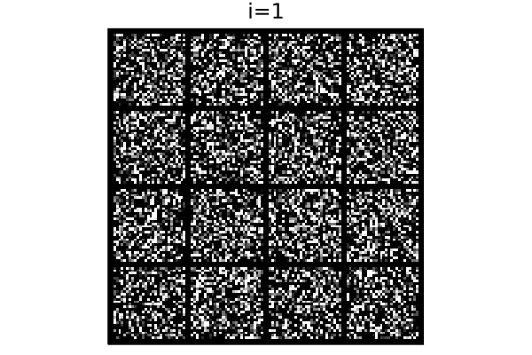
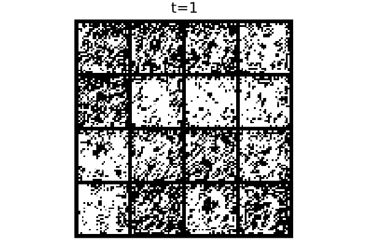

# DenoisingDiffusion.jl

A pure Julia implementation of denoising diffusion probabilistic models as popularised in [Denoising Diffusion Probabilistic Models by Jonathan Ho, Ajay Jain and Pieter Abbeel (2020)](https://arxiv.org/abs/2006.11239)

### Basic overview 


<p float="left">
  
   
  <p style="text-align:center">Reverse process (left) and final image estimate (right). These coincide on the final time step.</p>
</p>

Denoising diffusion starts from an image of pure noise and gradually removes this noise across many time steps, resulting in a natural looking image.
At each time step a model predicts the noise to be removed in order to reach the final image on the final time step from the current time step.
This allows an estimate of the final image to be created, which is updated at every time step. 
The above image shows this process with a trained model for number generation.

### Module 

The main export is the `GaussianDiffusion` struct and associated functions.
Various models and building blocks are included. 
The models includes a flexible `ConditionalChain` based on `Flux.Chain`. It can handle two inputs where the first is given priority over the second.
Two versions of UNets (convolutional autoencoder) are available, `UNet` and `UNetFixed`. A `UNet` model made to the same specifications as `UNetFixed` is 100% equivalent. 

`UNet` is flexible and can have an arbitrary number of downsample/upsample pairs (more than five is not advisable).
It is based on nested skip connections.
`UNetFixed` is a linear implementation of the same model. 
`UNetFixed` has three downsample/upsample pairs and three middle layers with a total of 16 layers. For the default configuration `UNetFixed(1, 8, 100)` will have approximately 150,000 parameters. 
About 50% of these parameters are in the middle layer - 24% in the attention layer alone.


For both models, every doubling of the `model_channels` will approximately quadruple the number of parameters because the convolution layer size is proportional to the square of the dimension.
 
### Examples

To run the examples: 
```
julia examples\\train_images.jl --threads auto
```

Or start the Julia REPL and run it interactively.

There are three use cases:
- Spiral (2 values per data point).
- Numbers (28&times;28=784 values per data point.)
- Pokemon (48&times;48&times;3=6912 values per data point.)

The spiral use case requires approximately 1,000 parameters. The number generation requires at least 100 times this, and the Pokemon possibly more. So far, satisfying results for the Pokemon have not been achieved.
See however [This Pokémon Does Not Exist](https://huggingface.co/spaces/ronvolutional/ai-pokemon-card)
for an example trained on 1.3 billion parameter model.

## Fretchet LeNet Distances (FLD)

For number generation the Fretchet Inception Distance (FID) is cumbersome. 
The [Inception V3](https://pytorch.org/hub/pytorch_vision_inception_v3/) model has 27.1 million parameters
which is overkill for number generation. Instead the simpler Fretchet LeNet Distance is proposed.
This uses the same calculation except with a smaller [LeNet model](https://github.com/FluxML/model-zoo/blob/master/vision/conv_mnist/conv_mnist.jl) with approximately 44,000 parameters.
The output layer has 84 values as opposed to Inception V3's 2048.

Example values are:

| Model         | Parameters | FLD   |
| ---           | ---        | ---   |  
| training data | 0          | 0.5   |
| UNet (MSE)    | 376,913    | 18.3  |
| UNet with attention (MSE)    | 602,705    | 23.9  |
| UNet (MAE)    | 376,913    | 39.3  |
| Random        | 0          | >337  | 

Because this can be very easily trained on a CPU no pretrained weights are necessary.
However the results will not be standardised.

## Installation

Download the GitHub repository (it is not registered). Then in the Julia REPL:
```
julia> ] #enter package mode
(@v1.x) pkg> dev path\\to\\DenoisingDiffusion
julia> using Revise # allows dynamic edits to code
julia> using DenoisingDiffusion
```

Optionally, tests can be run with:
```
(@v1.x) pkg> test DenoisingDiffusion
```

This repository uses FastAi's [nbdev](https://nbdev.fast.ai/tutorials/git_friendly_jupyter.html) to manage the Jupyter Notebooks for Git. This requires a Python installation of nbdev. To avoid using it, follow the steps in .gitconfig.

## Task list

- [x] Self-attention blocks.
- [ ] DDIM for more efficient and faster image generation.
- [ ] Guided diffusion.
- [ ] Super resolution models.